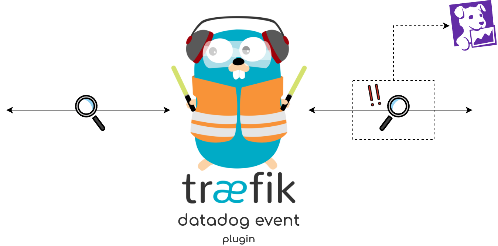

  

# Traefik Datadog Event

This plugin can be used to generate Datadog events if certain patterns match.

## Installation

You're on Github:
- Go to [Datadog Event](https://pilot.traefik.io/plugins/280005610925195785/datadog-event) on Traefik Pilot and click the `Install Plugin` button.

You're on Traefik Pilot:
- Click the `Install Plugin` button.

## Plugin options

**APIKey**

*Required: true*

Your Datadog API key.

### Patterns

**CodePattern**

This pattern compares the user-defined status code, with the response code.

**BodyPattern**

This pattern checks if the user-defined regex matches the response body.

> If you specify multiple patterns (e.g Code and Body) the plugin will generate a new event only if all of them match.

### Event options

**Title**

The event title. Limited to 100 characters. 

**Message**

The body of the event. Limited to 4000 characters. The text supports markdown.

**Priority**

*Default: normal*

The priority of the event. For example, normal or low. Allowed enum values: normal, low

## How to contribute
1. Check for open issues or open a fresh issue to start a discussion around a feature idea or a bug.
2. Fork [the repository](https://github.com/dgzlopes/traefik-datadog-event) on GitHub to start making your changes to the master branch (or branch off of it).
3. Write a test that shows that the bug was fixed or that the feature works as expected.
4. Send a [pull request](https://help.github.com/en/articles/creating-a-pull-request-from-a-fork) and bug [me](https://github.com/dgzlopes) until it gets merged and published.